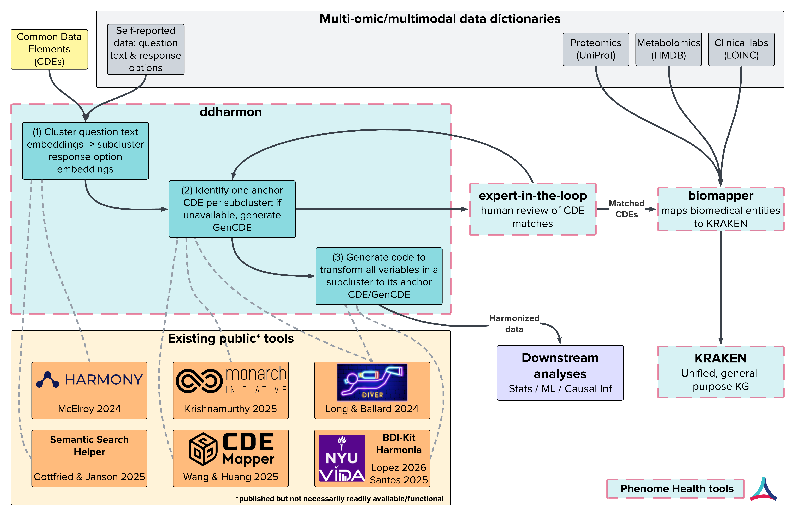

# ddharmon — Data Dictionary Harmonization Tool

ddharmon harmonizes biomedical **data dictionaries**: it identifies clusters of equivalent
variables across studies and recommends a Common Data Element (CDE) anchor for each — routing
every recommendation to expert review.



*Where ddharmon sits: cluster variables + CDEs → anchor a CDE per sub-cluster (or generate a novel
one) → expert review — alongside related public tools and the broader Phenome Health stack.*

## Quick start

Requirements: **Python 3.12+** and [uv](https://github.com/astral-sh/uv).

```bash
git clone https://github.com/Phenome-Health/ddharmon.git
cd ddharmon
uv sync --extra all
cp .env.example .env        # set ANTHROPIC_API_KEY for the classify pass (sync/batch)
```

Then open the end-to-end notebook **`notebooks/clustering/v1_harmonization_pipeline.ipynb`** — it
runs the full pipeline (ingest → embed → cluster → value sub-cluster → CDE anchor → adopt/refine/novel
→ review) on example data and is the best place to start.

> The NIH CDE catalog is not bundled. To anchor against CDEs, flatten the CDE repository locally with
> `scripts/flatten_cde_repo.py <All-CDEs.json> <out.tsv>`; without it, the pipeline still clusters and
> sub-clusters cohort variables (`cdeSet = none`).

## API key configuration

ddharmon reads the Anthropic API key from the `ANTHROPIC_API_KEY` environment variable — you must set it
before running the classify or batch passes. The responsibility for providing the key lies with the
caller (a human user, script, or host application embedding ddharmon); there is no settings UI or
per-session key handling in the library itself.

## Related work

Framing biomedical variable/CDE harmonization as an **embedding → clustering → optional LLM**
problem is an active line of work; ddharmon builds directly on it. The closest tools (full lineage
and citations in [`docs/v1_methods.md`](docs/v1_methods.md)):

- **CDEMapper** (Wang et al., *JAMIA* 2025) — LLM-powered mapping of local data elements to NIH CDEs
  via semantic indexing + BM25 + GPT candidates + human review. *Per-element lookup.*
- **Krishnamurthy et al., 2025** (arXiv:2506.02160) — embeds ~24k NIH CDEs and clusters them with
  HDBSCAN, then LLM-labels the clusters. *Clusters the target CDE repository.*
- **Salimi et al., 2025** (*Sci Rep*) — the **PASSIONATE** Parkinson's variable-mapping ground truth;
  shows language-model embeddings beat fuzzy string matching for **pairwise** cohort harmonization
  (frames matching as a clustering task, but stops at t-SNE visualization).
- **DataTecnica — DIVER / RoP** (Long et al., medRxiv 2024) — LLMs generate and audit CDEs at scale
  (**GenCDEs**); the RoP release ships ~1.33M harmonized CDEs with embeddings. *Closest to generating
  novel CDEs.*
- **Harmony** (McElroy et al., *BMC Psychiatry* 2024), **Semantic Search Helper** (Gottfried 2025),
  **datastew**, and **BDI-Kit** (Lopez et al., *Patterns* 2026) — embedding/LLM harmonization and
  schema/value-matching siblings.

## What ddharmon adds

These tools tend to cluster *either* a CDE repository *or* a single cohort, use a single semantic
vector, and map element-by-element. ddharmon targets the gaps that matter for harmonizing **many
studies at once**:

- **Multi-cohort, source *and* target together.** Cohort variables and the NIH CDE catalog are
  embedded and clustered in one space, so equivalent variables across many studies surface as a
  single cluster — not one pairwise lookup at a time.
- **Dual-vector, value-aware sub-clustering.** Each field gets a **semantic** vector (what it
  measures) *and* a **value** vector (how it is answered). Semantic vectors cluster the concept;
  **value vectors sub-cluster within a concept by encoding shape** — so "age in years" and "age
  bracket" land in different sub-clusters. Antecedents use a single vector and flat clusters.
- **A recommended CDE anchor per sub-cluster — with a novel-CDE path.** Each value sub-cluster is
  anchored to the best in-cluster CDE (medoid → canonicalness → metadata richness). When **no
  existing CDE fits**, the sub-cluster is flagged for a **generated (GenCDE) novel CDE** instead of
  being forced onto a poor match.
- **adopt / refine / novel → expert review.** One classify-only LLM call per sub-cluster proposes
  adopt / refine / novel against the anchor and routes every recommendation to **expert-in-the-loop
  (EITL)** review — nothing is auto-applied.

## How it works

```
ingest (cohorts + CDE)
  → dual-vector embed (semantic + value)
    → semantic cluster (BERTopic)
      → value sub-cluster (HDBSCAN on value vectors, per topic)
        → CDE anchor per sub-cluster (medoid → best in-cluster CDE; GenCDE fallback)
          → adopt / refine / novel  (single classify-only LLM call)
            → EITL review queue
```

Full algorithm, parameters, and lineage are in [`docs/v1_methods.md`](docs/v1_methods.md). The
research contributions held for a pending publication — LLM coherence judging, concept labeling,
transformation-spec authoring, granularity-loss detection, deep recursive clustering, and a CDE
common data model — are **not in v1**; see [`CHANGELOG.md`](CHANGELOG.md).

## Installation

The core install is lightweight; optional extras unlock additional capabilities.

| Extra | Use case |
|-------|----------|
| *(none)* | Core ingestion + lexical matching |
| `embeddings` | sentence-transformers + faiss-cpu — semantic embedding + vector search |
| `clustering` | scikit-learn, UMAP, plotly |
| `bertopic` | BERTopic topic modeling |
| `llm` | openai, anthropic — LLM classify / rerank |
| `all` | everything above (required to run the full pipeline + notebook) |
| `dev` | `all` + pytest, ruff, black, pyright |

```bash
pip install "ddharmon[all]"          # full pipeline
# or, with uv (recommended for development):
uv sync --extra all
```

## Development

```bash
./scripts/check.sh     # lint, format, typecheck, test
./scripts/fix.sh       # auto-fix lint + format
pytest                 # tests
```

### Project structure

```
src/ddharmon/
├── models/          # data models (plain dataclasses)
├── ingestion/       # multi-cohort + CDE dictionary parsers
├── embedding/       # dual-vector embedding (semantic + value), SQLite cache
├── clustering/      # BERTopic semantic clustering + value sub-clustering
├── harmonization/   # v1: CDE anchoring + adopt/refine/novel + EITL export
├── matching/        # pairwise 1:1 matching (built; not in the v1 surface)
├── llm/             # LLM clients + Anthropic Batch API
├── values/          # value-encoding parsing
└── export/          # visualization (dendrograms, UMAP, Plotly)
notebooks/clustering/v1_harmonization_pipeline.ipynb
scripts/             # flatten_cde_repo, build_clsa_csv, prompt runners, check/fix
tests/
```

## Roadmap (beyond v1)

- **Web GUI** — under development; the point-and-click app (upload dictionaries → run with live
  progress → review recommendations → export) will ship as added functionality of **biomapper-ui**.
- Pairwise **1:1 mapping** as a first-class surface (the engine is built).
- **Standards mapping** (LOINC / SNOMED / OMOP).
- LLM coherence judging, concept labeling, and transformation-spec authoring (publication-pending).

## License

MIT — see [LICENSE](LICENSE). © 2026 Phenome Health.
